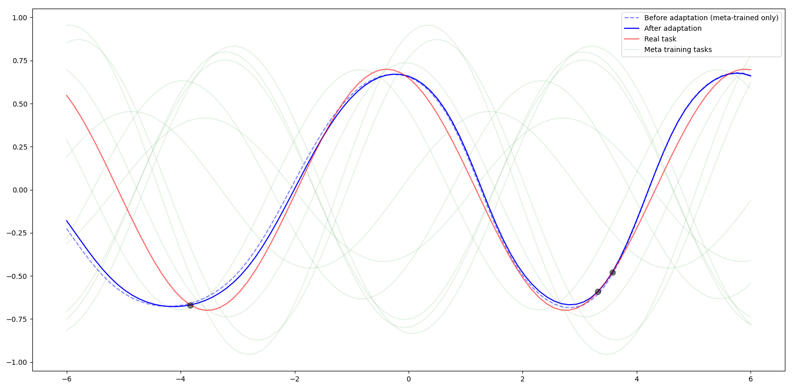
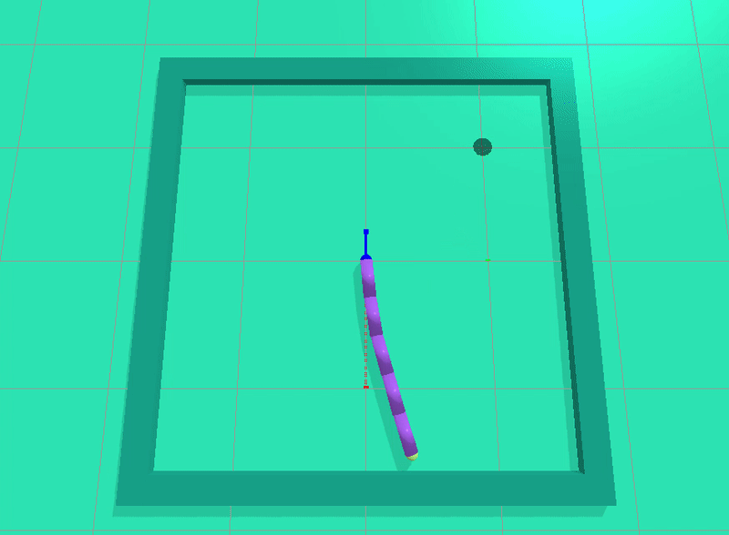

# FAMLE Algorithm

Code for the IROS 2020 paper ["Fast Online Adaptation in Robotics through Meta-Learning Embeddings of Simulated Priors".](https://arxiv.org/pdf/2003.04663.pdf)

**Abstract:** Meta-learning algorithms can accelerate the model-based reinforcement learning (MBRL) algorithms by finding an initial set of parameters for the dynamical model such that the model can be trained to match the actual dynamics of the system with only a few data-points. However, in the real world, a robot might encounter any situation starting from motor failures to finding itself in a rocky terrain where the dynamics of the robot can be significantly different from one another. In this paper, first, we show that when meta-training situations (the prior situations) have such diverse dynamics, using a single set of meta-trained parameters as a starting point still requires a large number of observations from the real system to learn a useful model of the dynamics. Second, we propose an algorithm called FAMLE that mitigates this limitation by meta-training several initial starting points (i.e., initial parameters) for training the model and allows the robot to select the most suitable starting point to adapt the model to the current situation with only a few gradient steps. We compare FAMLE to MBRL, MBRL with a meta-trained model with MAML, and model-free policy search algorithm PPO for various simulated and real robotic tasks, and show that FAMLE allows the robots to adapt to novel damages in significantly fewer time-steps than the baselines.

## Citing FAMLE:

If you use our code for a scientific paper, please cite:

>Kaushik, R., Anne, T., & Mouret, J. B. (2020). Fast Online Adaptation in Robotics through Meta-Learning Embeddings of Simulated Priors. In IEEE/RSJ International Conference on Intelligent Robots and Systems (IROS).

**BibTex**:
```latex
@inproceedings{kaushik2020fast,
  title={Fast Online Adaptation in Robotics through Meta-Learning Embeddings of Simulated Priors},
  author={Kaushik, Rituraj and Anne, Timoth{\'e}e and Mouret, Jean-Baptiste},
  booktitle={IEEE/RSJ International Conference on Intelligent Robots and Systems (IROS)},
  year={2020}
}
``` 

## Python package dependencies

* gym
* pybullet
* pybulletgym
* pytorch
* pathlib
* pyprind


## Preparation

Include the directory in PYTHONPATH
```shell
export PYTHONPATH=${PWD}:$PYTHONPATH 
```

## One simple example

Suppose we are given 3 data points, and we have to fit a neural network to these data points. There can be infinite possibilities of functions that can be fitted by the neural network given those 3 data points. However, suppose we know some prior information about the type of the underlying function. In that case, we can pre-train (i.e. meta-train) the neural network so that the network can be fitted to match the underlying function very closely with only a few data points.

Let the type of function that we are trying to fit are sinusoids with random phases and amplitudes. Using FAMLE, we meta-train a situation (or task) conditioned neural network, where each task is a randomly sampled sinusoid.

Once the network and the embeddings are meta trained, we select the most suitable embedding that can allow us to fit those 3 data points so that the model closely represents the true underlying function.

The above example can be visualized by running the script:

```bash
python ./example.py
```
This will take some time to meta-train the model (around 20 mins) and generate a plot similar to this:



Similar idea can be applied to learn the dynamical models of the robots online using only a few data points.

## Running the experiments:
FAMLE has two steps: 1. First, generate the data for various situations in simulation. 2. Use these data to meta-train the situation embeddings and the neural-network dynamical model, which is used for online adaptation in the real world.

### **Reacher environment**:

<!--  -->



### 1. Generate data (offline) for meta-training the model

```bash
python ./offline_data_collection/reacher_env_adaptation.py --iterations 10 --episode_length 100 --random_episodes 10
```
The collected trajectories will be saved in the directory ```./results/ensemble_reacher/<time-stemp>_experiment_<id>```

### 2. Meta-training with offline data and adapt online

```bash
python ./online_adaptation/reacher_env_meta.py --rand_motor_damage --iterations 100 --data_dir ./results/ensemble_reacher/<time-stemp>_experiment_<id>
```
The meta-trained model will be saved in the ```--data_dir``` after the training. If the experiment is re-run and the model is found in the ```--data_dir```, the model will be used directly for online adaptation without retraining.

A pre-meta trained model can be found in ```./pre_trained/ensemble_reacher/data``` and can be used for online adaptation directly as:

```bash
python ./online_adaptation/reacher_env_meta.py --rand_motor_damage --iterations 100 --data_dir ./pre_trained/ensemble_reacher/data
```

## Code developers/maintainers
* Rituraj Kaushik (Aalto University), Homepage: [https://www.riturajkaushik.ml/](https://www.riturajkaushik.ml/)